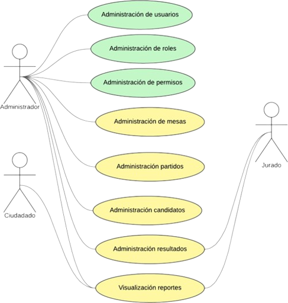
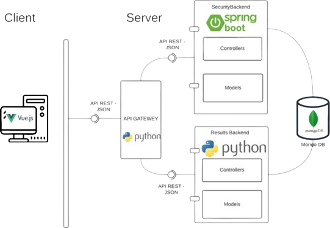
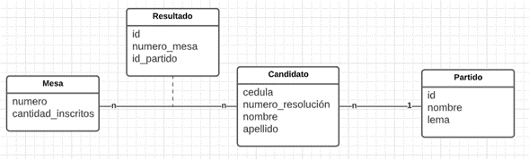
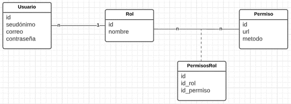

# BACK-END DEL PROYECTO
### VOTACIONES 2022

 

La REGISTRADURÍA NACIONAL DE COLOMBIA es una entidad con autonomía administrativa, contractual y presupuestal, organizada de manera desconcentrada, que tiene a su cargo el registro de la vida civil e identificación de los colombianos y la realización de los procesos electorales y los mecanismos de participación ciudadana, con plenas garantías para los colombianos.

## Información sobre el software

<b>Ver/ocultar la información general del software</b>

 

Se ha encomendado a los beneficiarios del módulo de Programación Web de Misión TIC 2022 de la Universidad Nacional de Colombia, que lleven a cabo el proceso de implementación del módulo de registro de resultados de las elecciones al senado bajo la modalidad de voto preferente. Es de aclarar que el voto preferente se da cuando el partido deja que los ciudadanos voten no solo por el partido, sino también por cada uno de sus candidatos individualmente.
Para este caso, lograrán una curul o puesto quienes obtengan mayores votaciones sin importar el orden que ocupaban dentro de la lista.
Para ello, se han realizado reuniones para formalizar los requisitos, obteniendo la siguiente información:

- **1.**	La plataforma por seguridad debe de poseer un módulo de gestión de usuarios, de los cuales es necesario conocer su nombre de usuario (seudónimo), correo y contraseña.

- **2.**	Cada uno de los usuarios posee un rol dentro de la plataforma, de cada rol se debe conocer el nombre. Los roles definidos en inicio son: Administrador, Jurado de votación y ciudadano. Más adelante se describe las funcionalidades a las cuales tiene acceso.

- **3.**	Con el fin de controlar el acceso a cada una de las funcionalidades de la plataforma, se ha visto la necesidad de implementar un módulo de administración de permisos, para determinar que roles tienen acceso a cada una de las funcionalidades de sistema (micro servicios). De los permisos se debe almacenar el identificador, la url y el método (GET, POST, PATCH, DELETE).

- **4.**	La administración de las mesas de votación, son de vital importancia ya que son la unidad básica en el proceso electoral, de estas se debe almacenar el número de mesa (que corresponde al identificador único) y número de cédulas inscritas.

- **5.**	En la plataforma se debe permitir la creación de los partidos políticos de los cuales se debe de almacenar, el nombre y el lema bajo el cual se fundamenta.

- **6.**	Cada uno de los partidos políticos, se compone de candidatos de los cuales se debe almacenar su número de resolución que lo acredita como candidato, cédula, nombre y apellido.

- **7.**	La razón de ser de la plataforma es la administración de los resultados, los cuales son emitidos por cada una de las mesas, es de aclarar que en cada mesa se registran los votos a los diferentes candidatos y que cada candidato puede ser votado en diferentes mesas.

- **8.**	Por último, es muy importante la visualización de reportes de las elecciones, tales como:

    **A.**	Listado de los votos obtenidos por todos los candidatos con el nombre del partido político al que pertenecen ordenados de mayor a menor de forma general por todas más mesas y también por una mesa en específica.

    **B.**	Listado de mesas con mayor participación ciudadana (suma de todos los votos de la mesa) ordenados de menor a mayor.

    **C.**	Listado de partidos políticos con cantidad de votos sufragados a su favor ordenados de mayor a menor de forma general y con opción de filtrar por mesa.
    
    **D.**	Distribución porcentual por partido político del nuevo congreso de la república. Tenga en cuenta que el congreso para esta edición será compuesto por los primeros 15 senadores más votados en todas las mesas.

<b>Ver/ocultar la información sobre los casos de uso del proyecto</b>

 

Teniendo en cuenta lo anterior se ha planteado el siguiente diagrama de casos de uso.

 

**NOTA:** Todos los casos de uso que se refieren a tareas relacionadas con “Administración” implica llevar a cabo procesos de Creación, Listado, Visualización, Actualización y Eliminación (CRUD). Por ejemplo, el caso de uso “Administración de candidatos” en la implementación de código debe, permitir crear un candidato, visualizarlo, modificar y eliminarlo teniendo en cuenta un atributo como por ejemplo su cédula y por último la funcionalidad de listar todos los candidatos existentes en la plataforma.

Por recomendaciones generales de expertos en plataformas de gestión de votaciones a nivel mundial, se ha recomendado que el sistema tenga una arquitectura orientada a microservicios y se ha planteado el esquema de la siguiente imágen.

 

<b>Ver/ocultar la información sobre la arquitectura del software</b>

 

Como se puede evidenciar el sistema se divide en 2 partes inicialmente, cliente – servidor. En el cliente (front-end) se requiere llevar a cabo la implementación utilizando el framework “Vue JS” y se darán ampliarán los detalles más adelante. Por el lado del servidor (back-end), se encuentra la arquitectura distribuida en 3 partes fundamentalmente, el primer lugar se encuentra el “api gateway” el cual es el encargado de recibir todas las peticiones realizadas por el cliente, y su función principal es llevar a cabo el proceso de redirección de las peticiones ya sea al back-end de seguridad o al back-end de los resultados, a su vez actúa como interceptor “middleware” para validar si determinado usuario con su respectivo rol, tiene acceso a la petición solicitada. Por ejemplo, en caso que un ciudadano cualquiera quiera modificar un resultado de alguna mesa, el middleware debería denegarle la transacción ya que este no posee el permiso suficiente para llevar a cabo esta tarea.

En segundo lugar se encuentra el back-end de seguridad, el cual por recomendaciones de seguridad se de implementar utilizando Java Spring Boot, en este se llevará a cabo toda la gestión de usuarios, roles y permisos. Esto quiere decir que los casos de uso 1, 2 y 3 descritos anteriormente (los que aparecen en color verde en la imagen 1 “Diagrama de casos de uso de la plataforma”) se deben de implementar allí.

En tercer lugar se encuentra el back-end de resultados, el cual se debe implementar Python Flask, allí se encontrará el desarrollo de los casos de uso 4, 5, 6, 7 y 8, descritos anteriormente y que están en color amarillo en la imagen 1.

Es de aclarar que tanto el back-end de seguridad como el de resultados tendrán acceso a la capa de persistencia. En esta parte se utilizará una base de datos no relacional usando Mongo DB. Se utilizará el formato JSON para las comunicaciones entre los diferentes módulos del sistema.

Para la implementación del sitio web (Cliente o Front-end) se deben de tener en cuenta las siguientes consideraciones:

**A.**	Se debe diseñar un portal web, una página inicial, la cual describe la información general de la registraduría, con secciones tales como “quienes somos”, “misión”, “visión”.

**B.**	Por seguridad, en el sistema de información se debe realizar un formulario de identificación de usuarios, donde a través de las credenciales de acceso “login” (usuario y contraseña, el usuario será el email de la persona) tendrán acceso al sistema. La contraseña deberá ser almacenada de forma cifrada. Solo los usuarios identificados podrán acceder a las funcionalidades del sistema.

**C.**	Roles: Debido a que existen diferentes grupos de personas que interactúan con el sistema, es necesario realizar la administración usuarios, roles y permisos. Los roles que se han planteado inicialmente en la plataforma son:

**1.**	Administrador de la plataforma: Tiene acceso a todos los módulos.
**2.**	Jurado: Tiene acceso a módulo de gestión de resultados y reportes.
**3.**	Ciudadano: Solo tiene acceso al módulo de reportes de los resultados.

**D.**	Según se el rol correspondiente, se debe poder visualizar cada uno de las vistas para la manipulación de todos los casos de uso descritos anteriormente.

## Diagramas de la Base de Datos del software

A continuación se presentan los diagramas correspondientes a la base de datos del back-end de los resultados y del back-end de la seguridad.

- ### Diagrama Base de Datos Back-end de Resultados (Python - Flask)

    

- ### Diagrama Base de Datos Back-end de Seguridad (Java - Spring Boot)

    

## Requisitos técnicos

- Vistas de alto rendimiento considerando el funcionamiento asíncrono mediante promesas.

- Usar un framework de CSS para el desarrollo de la GUI. La cual debe considerar principios de usabilidad, tener apariencia agradable y ser responsiva.

- Implementar el sistema mediante tecnologías de desarrollo web Back-end (utilizando Python-Flask y Java-Spring Boot) y Front-end (utilizando Vue JS)

- Se pueden implementar otros aspectos que supongan profundizar en alguna de las tecnologías vistas durante el módulo. Dichos aspectos deberán ser autorizados por el profesor.

- Comentar el código de manera formal.

- Se debe entregar un documento con el manual de usuario del sistema y un documento con el análisis y la definición de la base de datos.

- El control de versiones debe ser administrado con Git, y el control de actividades debe ser llevado a cabo con una herramienta en línea que lo permita como Trello. En ambos casos deben notificar y agregar al profesor.

## Instalación

Para correr este proyecto localmente debes seguir los siguientes pasos:

### 1. Clonar este repositorio
    $ git clone https://github.com/iamjosuefischer/registraduria-backend.git

### 2. Crear y activar el entorno virtual
    $ python -m venv env
    $ env/Scripts/activate

### 3. Instalar los paquetes del proyecto
    $ pip install -r requirements.txt
   
### 4. Correr el servidor
    $ flask --app main run

## Repositorios de este proyecto

En los siguientes repositorios de GitHub se puede encuentrar el back-end, el componente de seguridad y el front-end de este proyecto.

### Back-end

 - <a href="https://github.com/iamjosuefischer/registraduria-backend">Back-end del proyecto de la registraduría</a>

### Seguridad

 - <a href="https://github.com/iamjosuefischer/registraduria-seguridad">Componente de seguridad del proyecto de la registraduría</a>

### Front-end

 - <a href="#">Front-end del proyecto de la registraduría</a>

